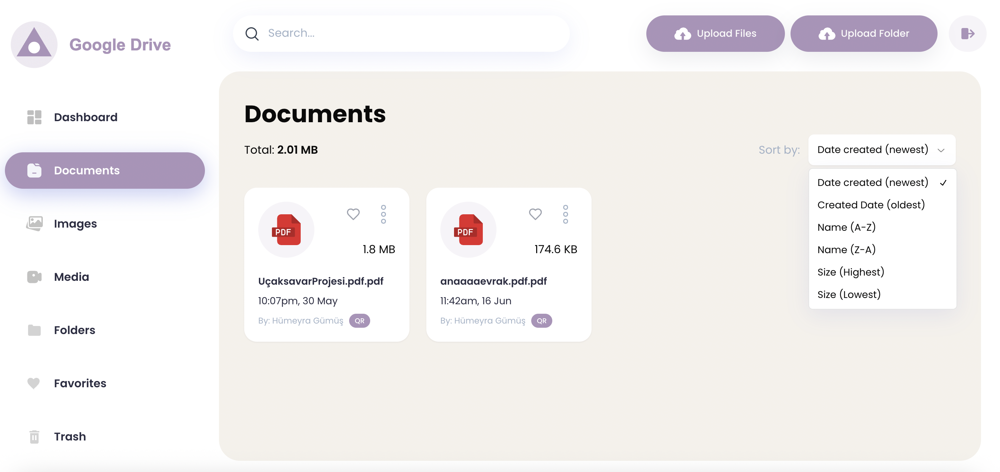
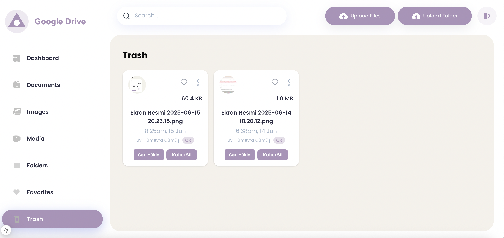
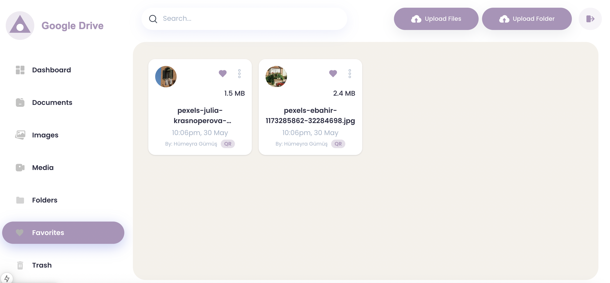

# Google Drive Clone

A web-based cloud storage application inspired by Google Drive, built with **Next.js**, **TypeScript**, and **Appwrite**.  
This project allows users to upload, organize, preview, and manage their files securely with a clean and modern user interface.

The Google Drive Clone project replicates the core functionality of a cloud file management system. Users can upload files and folders, view recent uploads, check storage usage, and organize their data efficiently. The application is fully responsive, ensuring a seamless experience on both desktop and mobile devices.

## Features

- Secure user authentication powered by Appwrite  
- File and folder upload, rename, and delete functionality  
- Real-time storage usage tracking  
- Dynamic dashboard displaying categories and upload statistics  
- Recent uploads section for quick access  
- Trash system for restoring or permanently deleting files  
- File type filters such as Documents, Images, and Media  
- Responsive design built with Tailwind CSS and Next.js  

## Technologies Used

- **Next.js 14 (App Router)**  
- **TypeScript**  
- **Appwrite** (for backend, authentication, and storage)  
- **Tailwind CSS**  
- **Shadcn/UI**

## Preview






## Installation and Setup

To run this project locally:

1. Clone the repository:
   ```bash
   git clone https://github.com/humeyragumus/google-drive-clone.git

 2. Navigate to the project directory:
     ```bash
     cd google-drive-clone
     
 3.	Install dependencies:
     ```bash
     npm install
     
4. Configure environment variables:
   Create a new file named .env.local in the root of the project and add your Appwrite credentials
   ```bash
   VITE_APPWRITE_ENDPOINT=https://cloud.appwrite.io/v1
   VITE_APPWRITE_PROJECT_ID=your_project_id
   VITE_APPWRITE_DATABASE_ID=your_database_id
   VITE_APPWRITE_BUCKET_ID=your_bucket_id 

5.	Run the development server:
  ```bash
  npm run dev


 ```  
6. View the project:
 Once the server is running, open your browser and visit:
 
 **http://localhost:3000/**


     
    

     
